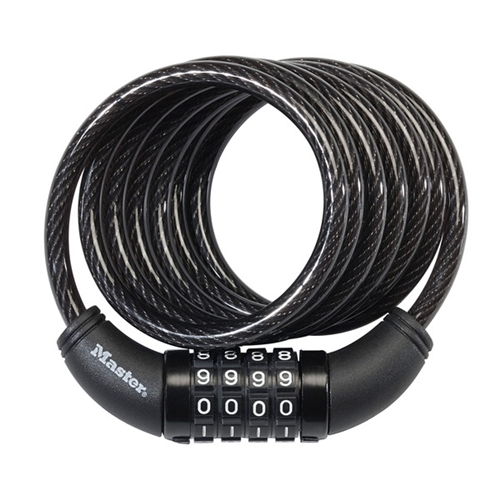

# Combination Lock Cracker

This project is an attempt at cracking combination lock combos. 

***NOTE:*** *This project is for purely educational purpose. In fact, it is an attempt at showing why combination locks are unsafe!*

## Hypothetical Scenario

Let's say that a person, let's call this person **`A`**, has a bike and of course a bike-lock. His or her bike-lock is a 4-digit password system. More precisely, it's a system where numbers are placed in a rotating manner, like this image here:
  
> *image source: https://www.dormco.com/Combination_Cable_Bike_Lock_Master_Lock_Dorm_p/gh2-1-3-8114d.htm*

Imagine another person, let's call this person **`B`**, wants to steal **`A`**'s bike. Now, **`B`** is intelligent, so he will try not to get caught. To do so, he will try to figure out **`A`**'s bike-lock combination. More precisely, **`B`** will stalk **`A`**, and every time locks his or her bike the the bike-lock, **`B`** will do the follwoing threw actions:

- Observe what combo is left on the lock
- Attempt to unlock the bike-lock without changing the combo
	- If it unlocks, **`B`** takes the bike
	- If it doesn't, **`B`** records the combo that he has seen (in this case, **`A`**, as one can expect, would have shuffled the combo)

Eventually, **`B`** will have a long list of `n` different lock combos (`n` being an integer), with which **`B`** hopes to analyze in order to figure out the true combo that will unlock the bike. 

NOTE: You can read the [article I wrote about this]({{TODO:LINK_TO_MEDIUM_ARTICLE_WHEN_PUBLISHED}}) on medium.

## Analysis

Before you jump to the conclusion that this is hopeless, let me attempt to reason you out otherwise. We observe the following.

If **`A`** desires not lose his or her bike, **`A`** will *always* shuffle the combo. Let's assume that is true. Then, there are only two safe ways to shuffle the bike-lock combo (in order of highest safety to lowest):

1. Shuffling the combo to the same exact number every single time
2. Shuffling the combo randomly using a random number generator

Assuming **`A`** uses neither of these shuffling methods, **`A`**'s shuffling *will not be random*, and that is key to this entire project. Whenever data is not random, there exists an algorithm that can exploit it to extract useful information out of it, and that is likely the most important aspect of this entire project.

**Why is (1) the safest solution?** If we are using data analysis algorithms to figure out the code, the more data we have, the better. However, (1) doesn't help because observing the same information twice in a row does not add any new informations! Although we'd be use that the combo that we always see is not the correct one, that rules out 1 out of too many possibilities. Most locks have 4 to 5 digits, so it's one out of 10000 to 100000 combinations (assuming the combinations only have numbers).

**Why is (2) also safe, although not as safe as (1)?** Using a truly random number prevents any data analysis algorithm to find a pattern or structure to the data. However, the problem with this is that given enough time, **`B`** will be able to rule out enough combinations to reduce the set of possible true codes to a small subset of the entire sample space. However, this is still safe because it's simply not practice to wait this long for a bike or anything else. Assuming 4 digits, there are 10000 possible codes. Assuming **`B`** is able to get at most 5 shuffled combos per day, it will still take **`B`** at least about 5.5 years to rule out every single code and likely more due to the fact that **`B`** will start rereading the same combo multiple times. 

So, with that in mind, we are ready to tackle this challenge.

## Probabilistic Approach

At this point, let's think of the true combo as `X`, and let's think of the shuffled combo observations as `y_i` for `i` in the set `{1, 2,...,n}` (i.e., we've made `n` observations). Our goal is to use the `y_i`'s in order to get closer to `X`. 

The model we will use is the [naive Bayes classifier (NBC)](https://en.wikipedia.org/wiki/Naive_Bayes_classifier). Modeling this problem as an NBC makes sense. NBC require that there is one latent/hidden variable, which is `X` in our case. Additionally, NBC's require that the observations made are each independent of each other, which also makes sense in this case. Every time **`A`** needs to unlock the lock, **`A`** enters the true code. Then, when they lock it again, they reshuffle. It doesn't make much sense for **`A`** to pick the new shuffled code based on what the previous shuffled code. However, note that we can't assume that every human being will act the way we expect them to act, so there is a non-zero chance that someone does shuffle their code based on the previous shuffled code. Nevertheless, we will assume that this does not happen by assuming that the observations are independent of each other.

So, we get the following image:

> *image source: I took this photo.*

Initially, we have no idea what `X` really is. So, it's in our best interest to guess that the probability that `X` is any number `s` in the set `S = {0000, 0001, ..., 9998, 9999}` is uniform over that set. (Note that we use lower case `s` for one of the number, and note that we use 4-digit numbers in the set. However, this can still be extended to having `d` digits where `d > 0` is an integer. For more clarity, we use `d = 4`). 

Let's assume that we are at a point that for any `s` in the set `S`, the probability that `X = s` is `p_s`. At this point, we also have made the observation `y_i`. So, we need to update, for every possible `s`, their probabilities. I.e., what is the probability that `X = s` given that we have observed `y_i` for each possible `s` and the same `y_i`? That is what we update the new probability that `X = s` to. So, we do the following:

- Loop over each `s` in the set `S = {0000, 00001, ..., 9998, 9999}`
    -   Update the probability that `X = s` given that we observed `y_i` using the following

        ```
        p(X=s|y_i) = p(y_i|X=s) * p(X = s) / p(y_i)
        ```
        
        Note that we have use [Bayes' rule](https://en.wikipedia.org/wiki/Bayes%27_theorem) above to figure. Then, using the [law of total probability](https://en.wikipedia.org/wiki/Law_of_total_probability), we can update `p(y_i)` in the following way:

        ```
        p(y_i) = sum_over_every s in S: p(y_i|X=s) * p(X=s) / p(y_i)
        ```

        We are justified to use the law of total probability because if `X = s`, then `X` cannot equal any other values in the sample space `S` that is not `s`. I.e., each of the `s`'s form a partition of the sample space. 

In the above algorithm, we already know `P(X=s)`. This number is `p_s` that we were given. However, what do we do with `p(y_i|X=s)`? This is the probability of observing `y_i` given that `s` is the true code (i.e. given that `X = s`). 

Intuitively, if `y_i` equals `s`, then it is extremely unlikely to observe `y_i` because in that case it'd be the true code. Thus, `p(y_i=s|X=s)` is an extremely small number. With the assumption that **`A`** above always shuffle, this quantity is `p(y_i=s|X=s) = 0`. To be clear, the only way we know that `y_i` is not the code is because we assume we are able to always check for ourselves before we do the recording. However, it is possible that we don't always have that opportunity. 

Another intuition is that if we see a shuffled combo, we should expect that number to be far away from the true code. For example, if the true code is `5555`. We should be more likely to see `1234` than `5554` because `5554` is so close to the true code. Psychologically speaking, the person who shuffles the code will always try to stay away as far as possible to the true code.

Finally, one can easily see that from those two intuitions above, thinking about `p(y_i|X=s)` is far easier than thinking about `p(X=s|y_i)`. In fact, the attempt to solve this problem is for us to *define* how `p(y_i|X=s)` given every possible pairs of `y_i` and `s`, both of which come from the same sample space `S`. So, that is what we do in the following sections.

## Defining the Observation Models

It is evident that choice of observation model will dictates how close we get to the true combo. The **observation model** is simply a fancy term for the probability function `p(y_i|X=s)` (the probability of observing `y_i` given that the true code is `s` for every possible `y_i` and `s` both in the set `S`). They call it observation model because it is a model that dictates how we update our belief after having observed an observation.

One thing to mention about the observation models is that they all imply that we cannot actually go into the combination lock and check whether the code we have seen is the true code. The reason they don't make that assumption is because the numbers simply work in a cleaner way. At the same time, they do not hinder the fact that seeing a given combo should tremendeously reduce the probability that that code is the true code. So, let's dive into some of the observation models we attempted to solve this problem.

### Black And White Model (BWM)

This model is the simplest. It says that `p(y_i|X=s) = 1/n` if `y_i = s` and `p(y_i|X=s) = 1 - 1/n` if `y_i != s`, where `n` is the number of elements in the sample space. If we are dealing with a 4 digits combination lock, then `n = 10000`. So, the intuition behind this model is that it says that the probability that we observe a given combo `y_i`should be extremely small if the combo we observe is the true code. In addition, this model implies that the probability that we observe a combo `y_i` that is not the true code should be extremely high! In essence, we should expect not to see the true code, and this model models that really well.

#### Advantages of BWM

This model effectively rules out the combo that we have observed, which we expect to be wrong.

#### Disadvantages of BWM

This model has one main disadvantage. It's extremely naive. The reason it is naive is that it behaves the same way for every other combo that is not the not the combo we observed. For example, if we observe `3333`, this model will reduce the probability of `3333` by some high percentage, and then it will increase the probability of every other numbers by the same exact and small percentage. So, all it ends up doing is rule out the number we observe. 

#### Conclusion

This model should definitely not be used, but it's a good starting point. This model clearly shows that we need to be more creative than that.

### Digit Distance Model (DDM)

This model is a bit more complex than the BWM. The intuition behind this model is that whenever a human person shuffles their code, the human likely want the code to be as far as possible from their true code. This model is an attempt at defining "far away". Personally, when I shuffle my bike lock (before knowing this of course), I would always feel anxious if I see 1-2 of the original digits on the shuffled combo. So, I'd shuffle further.

Thus in this model, `p(y_i|X=s)` depends on how many digits are differing from the true code. In the simple four digits combination lock case where `n = 10000` (`n` is the total number of possible digits):

- `p(y_i|X=s) = 1/n` if there is `0` digit differing.
- `p(y_i|X=s) = 36/n` if there is `1` digit differing.
- `p(y_i|X=s) = 486/n` if there is `2` digit differing.
- `p(y_i|X=s) = 2916/n` if there is `3` digits differing.
- `p(y_i|X=s) = 6561/n` if there is `4` digits differing.

In order to get the numbers in the nominator, we made use of the following formula: `nCr(4, i) * 9^i` for each `i in {0,1,2,3,4}`. `i` is the number of digits differing, so first, in the set of `4` digits, we choose `i` of them to be different, thus `nCr(4,i)`. Then, for those differing digits, we have `9^i` possibilities. For example, the 36 possibilities for `0000` are `j000`, `0j00`, `00j0`, and `000j` where `j` is each of `{1,2,3,4,5,6,7,8,9}`. 

In general, if we had `d` digits, `p(y_i|X=s) = nCr(d, j) * 9^j/n` where `j` is the number of digits different in `y_i` and `s` and `j` is in the set `{0, 1, ..., d}`. Note that the digit difference is done by index. So, for each index, we check wether the two digits are are the same or differing.

#### Advantages of DDM

This model is the very first model that works quite well given enough data. I gave myself the goal of trying to solve this by just collecting `20` different readings, and this model was able, in one of the cases, to have my true combo within the top 100 digits. 

#### Disadvantages of DDM

The main disadvantage of this model is that whenever there are less than `d` digit different, this model will heavily penalize all the digits that are the same in the original combo. For example, if the true code is `0000` and we observed `0414`, most numbers that include `0` as a first digit will have their probability reduced, and this is bad. Simply looking at the numbers for `4` digits, you can see that the probability for `3` digit differing is `0.2916`, which is lower than `0.5`. So, all those combos' probabilities will be lowered. 

The reason the above argument is really bad is because it works really bad for whenever there is only `1` digit that stays the same (we're focusing on a `4` digit combo here). In general, we should not expect to see `2` digits the same as in the original code. However, seeing one digit as the same is not uncommon. I feel like there should be a higher chance to see `3` digits difference. Maybe somewhere around `0.35` or `0.40`, but that's just intuition. 

Finally, the `1` digit that is the same problem is harder to pronounce if the number of digits increases. For example, if we had `10` digit codes, then maybe it'd be `2` digit that is also bad. 

#### Conclusion

The disadvantage above is not too bad. This model can be used. However, it may require a lot more data. In addition, a problem with this model is that although more data is good, sometimes bad data can be disadvantageous (such as those numbers with only `3` digits differing in a `4` digit lock case). 

### Edit Distance Model (EDM)

This model is a bit more complex than the DDM. It has the same intuition as DDM, except that instead of thinking of what digits are different, we are thinking of the distance as the [edit distance](https://en.wikipedia.org/wiki/Edit_distance) from observation to true code (which should be the same if we went the other way). The edit distance of two strings is how the minimum distance needed to change one string into the other by performing one of three edits---inserts, replacements, and deletes---where each edit incurs a distance (or cost). 

For the EDM, the only types of edit that we're allowed to make in terms of edit distance are replacing edits. I.e., in terms of edit distance, we pick the minimum edit such that the replacing cost is given for different replacements (we'll talk about these next), the delete cost is `infinite`, and the inserting cost is also `infinite` (setting the cost to `infinite` is the mathematical way of saying that using that type of edits is extremely bad).

Now, in terms of replacement cost, the cost of changing a digit `d_original` into another digit `d_destination` is the minimum number of rotations needed to go from `d_original` to `d_destination` in the digit wheel in most combination locks. Since the locks are organized in a wheel compartmentalized into 10 digits (`0` through `9`), we can always rotate up or down to go from one digit to another. In the EDM model, we make the assumption that we rotate in them most minimal way. For example, to rotate from `1` to `4`, rotating up costs `3` (switching to `2` then `3` then `4`), whereas rotating down costs `8`. So, the cost in this model will be `3`.

Now, `p(y_i|X=s) = map[cost] / n` where `cost` is the edit distance from `y_i` to `s`, `n` then number of possible digits, and `map` is a [hash-table](https://en.wikipedia.org/wiki/Hash_table) mapping the `cost` to the number of numbers that differ by that cost. For example, in the `4` digit case, our hash-table is:

|difference|numbers with difference|
|:---:|:---:|
|0 | 1 |
|1 | 8 |
|2 | 32 |
|3 | 88 |
|4 | 192 |
|5 | 356 |
|6 | 576 |
|7 | 824 |
|8 | 1056 |
|9 | 1224 |
|10 | 1286 |
|11 | 1224 |
|12 | 1056 |
|13 | 824 |
|14 | 576 |
|15 | 356 |
|16 | 192 |
|17 | 88 |
|18 | 32 |
|19 | 8 |
|20 | 1 |

This hash-table is symmetric around 10, as can be seen. In addition, the values in this hash-table sum up to 10000.

#### Advantages of EDM

This model further models the concept of rotating digits up and down. So, it may be able to better model how humans shuffle digits.

#### Disadvantages of EDM

Although it models the real life shuffling, this model assumes human efficiency of picking the best fastest way to shuffle. So, this ends up causing problematic results. 

In addition, this model assumes that humans are shuffling digits one by one. However, that is often not the case. Usually, they shuffle 2-3 digits at once. 

#### Conclusion

This model also works well. In contrast to DDM, this model doesn't really penalize having one digit difference as long as the number of edits is matched. However, when testing this model, the actual results were a bit more sporadic. So, it can be used, but it's harder to measure how "connected" are the end results of most probable digits after having done multiple observations. 

### Edit Distance Model with Encouraged Distance (EDMwED)

This model is the same as the above, except it encourages having higher differences. Essentially, what we do is multiply each mapping by a certain function `f(cost)`, then the probability becomes the sum the mapping divided by the sum of every costs.

Attributing advantages or disadvantages to this model is hard to tell. It's very at core experimental, so it's something to test out and see how it performs.

See advantages. 

#### Conclusion

When measured, this turned out to have terrible results. I am not sure how to explain it yet, but it seems that the boosting of distances is not "natural" in the way humans usually shuffle combination locks.

### Edit Distance Model with Rotations Up Only (EDMwRUO)

This is the same as EDM, but we are only allowed to have upward rotations. The resulting mapping becomes the following:

|difference|numbers with difference|
|:---:|:---:|
| 0 | 1 |
| 1 | 1 |
| 2 | 4 |
| 3 | 4 |
| 4 | 10 |
| 5 | 10 |
| 6 | 20 |
| 7 | 20 |
| 8 | 35 |
| 9 | 35 |
| 10 | 56 |
| 11 | 56 |
| 12 | 84 |
| 13 | 84 |
| 14 | 120 |
| 15 | 120 |
| 16 | 165 |
| 17 | 165 |
| 18 | 220 |
| 19 | 220 |
| 20 | 282 |
| 21 | 282 |
| 22 | 348 |
| 23 | 348 |
| 24 | 415 |
| 25 | 415 |
| 26 | 480 |
| 27 | 480 |
| 28 | 540 |
| 29 | 540 |
| 30 | 592 |
| 31 | 592 |
| 32 | 633 |
| 33 | 633 |
| 34 | 660 |
| 35 | 660 |
| 36 | 670 |


#### Advantages of EDMwRUO

This seems to further model the concept that humans usually shuffle in one direction.

#### Disadvantages of EDMwRUO

Even though humans usually shuffle in one direction, they often shuffle in one direction for a bit then shuffle in the other for more. In addition, they often change their shuffling patterns over time even though the underlying assumption to remain far away from their true code is maintained.

#### Conclusion

This model doesn't work as well as it could. When ran, many digits ended up being different from each other when they shouldn't. The same thing happened with the EDM model. The model sounds promising, but it doesn't work as well on my data. 

### Edit Distance Model with Rotations Down Only (EDMwRDO)

This is similar to EDMwRUO, except we rotate down. The mapping is the same, and the advantages and disadvantages are the same as well. The conclusion is also the same.

## Results

I have a 4-digit bike-lock, and I did 3 things: 
- recorded two sets of 20 combos of simulated readings. For each simulated reading, I would set my true combo, then shuffle the code, then record the reading. Let's call these data sets `sim1` and `sim2`
- recorded two sets of 20 combos of observed readings. I would bike, and whenever I locked my bike, I would record whatever shuffled reading. Let's call these data sets `obs1` and `obs2`
- generated two sets of 20 combos of random readings. I generated them using python. Let's call these data sets `rand1` and `rand2`.

For each data set, I ran each of the models and recorded whether my code appeared in the top 100 digits.

### BWM

| data set | Appears in top 100 | number of 1 digit off in top 100 |
|:---:|:---:|:---:|
| obs1 | no | 0 |
| obs2 | no | 0 |
| sim1 | no | 0 |
| sim2 | no | 0 |
| rand1 | no | 0 |
| rand2 | no | 0 |

*The results in this case had all the same probabilities, so this is equivalent to a no*

### BWM with Adjacency

| data set | Appears in top 100 with `max_distance = 2`| Appears in top 100 with `max_distance = 3` | number of 1 digit off in top 100 |
|:---:|:---:|:---:|:---:|
| obs1 | no | no | 0,0 |
| obs2 | no | no | 0,0 |
| sim1 | no | no | 0,0 |
| sim2 | no | no | 0,0 |
| rand1 | no | no | 0,0 |
| rand2 | no | no | 0,0 |

*With comma separated, we have then umber of 1 digit off in top 100 with `max_distance = 2` then `max_distance = 3`*

### DDM

| data set | Appears in top 100 | number of 1 digit off in top 100 |
|:---:|:---:|:---:|
| obs1 | no | 1 |
| obs2 | no | 0 |
| sim1 | no | 3 |
| sim2 | no | 1 |
| rand1 | no | 0 |
| rand2 | no | 0 |

### DDM with Adjacency 

| data set | Appears in top 100 with `max_distance = 2`| Appears in top 100 with `max_distance = 3` | number of 1 digit off in top 100 | 
|:---:|:---:|:---:| :---:|
| obs1 | no | no | 1,2 |
| obs2 | no | no | 0,0|
| sim1 | yes | yes | 5,6 |
| sim2 | no | no |  2,1 |
| rand1 | no | no | 0,0 |
| rand2 | no | no | 0,0 |

*With comma separated, we have then umber of 1 digit off in top 100 with `max_distance = 2` then `max_distance = 3`*

### EDM

| data set | Appears in top 100 | number of 1 digit off in top 100 |
|:---:|:---:|:---:|
| obs1 | no | 0 |
| obs2 | no | 3 |
| sim1 | no | 3 |
| sim2 | no | 0 |
| rand1 | no | 0 |
| rand2 | no | 0 |

### EDM with Adjacency

| data set | Appears in top 100 with `max_distance = 2`| Appears in top 100 with `max_distance = 3` | number of 1 digit off in top 100 with | 
|:---:|:---:|:---:| :---:|
| obs1 | no | no | 0,0 |
| obs2 | no | no | 5,5 |
| sim1 | no | no | 3,3 |
| sim2 | no | no | 0,0 |
| rand1 | no | no | 0,0 |
| rand2 | no | no | 0,0 |

*With comma separated, we have then umber of 1 digit off in top 100 with `max_distance = 2` then `max_distance = 3`*

Every other EDM models work with results similar to EDM.

## Critics on our Approach

The observation models that we have describes are not the only possible ones. One could, if he or she wanted, come up with more complex models that solve this problem more efficiently. I spent a lot of time to come up with these, but I hope they give you some perspectives into other things that we can do. If you discover another solution that works well, please hit me up I'd like to know. Anyway, let's discuss the other possible ways of solving this problem.

### Using the Resulting Probabilities to Derive A New Distribution by Adjacency

This is a special additional model. This model can be applied to every other models. 

Essentially, when the person is ready to see the top 100 possible codes after having made observations (or top `k` codes), one can set the adjacency to be `**true**`. Then, that will take every probability combos, change them by `i` edit distances as explained in the EDM model, and assign those resulting changes the probability `p/(i+1)` where `p` is the probability of the combo we're currently looking at.

For example, if `p = 0.1` for `0000`, then this will add into the probabilities of `0000` the value `p/1`, into each of `0001`, `0009`, ..., `1000`, `9000` the value `p/2`, etc... until reaching a maximum edit value that will also be given in the parameters. Then, at the end, it will normalize all the resulting probabilities. 

This model is an addition that works well only with some given models. For instance, this works really well with DDM because most often, DDM will remove result in numbers that are 1 digit off from the true code appearing in the top `k` probable. This allows to give off some probabilities from those `1` digits off into the `0` digit off. 

For other models, it hasn't been widely tested. However, it doesn't seem to be promising for other models.

Since this is an addition, it doesn't have to always be used. So, it's up to the user to decide whether to use it. I'd recommend using it just to quickly test how well it approaches a given code. 

### Using Digit Probabilities

One way to change the way we approach the problem is to look at each observation as an observation for each individual digits. So, let's say the true code is `5555` and we observe `1111`. Instead of updating the overall distribution of `s` in the set `S`, we update the distribution of the first, second, third, and fourth digits separately. Also, for each digits at index `k`, we can think of the true digit at index `k` as being the latent random variable `X_k` and we just made the observation `y_i^(k)` (note that the `^(k)` is not an exponent; it's a superscript. It's just saying, look at digit at index `k` of the new observation `y_i`). Then, we can treat solve for index `k` using an naive Bayes classifier (NBC). 

One question that this raises is that the relationship between each digit is definitely not independent. Whenever someone picks a code, they choose a code they like or relate to. So, that means that we could possibly learn about how digit at index `k` relates do digits at index `k+1` and `k-1` (or every other digits as well). 

Anyway, I actually tried the digit model using an observation model such that the probability of observing `y_i^(k)` given that the true digit is `X_k = s_k` is `1/10` if `y_i^(k) = s_k` and `9/10` otherwise. This worked pretty well, and it worked really close to the difference distance model. 

### Using Digit Relativities

Digit relativities is essentially the last point of the above subsection on Using Digit Probabilities. We could also use an NBC here and say that for the digits at index `j` and index `k`, their distance (how far they are from each other, i.e. the absolute value of their difference) is a random variable `X_(j,k)`. Then, whenever we observe `y_i`, we look at the difference for the index `j` and `k` in that observation, let's call it `y_i^(j,k)` (note that this is also not an exponent; it's a superscript again). So, we could use an NBC and update our belief about what `X_(j,k)` should be after having observed `y_i^(j,k)`. 

I personally feel like although this relativity could be non-random, it seems like it's very insignificant based on the observations. Whenever the person shuffles, the difference we observe in the shuffled combo could be close to random even when the person is not shuffling randomly.

### Using A Different Core Model

Notice that by choosing to use a naive Bayes classifier (NBC), we have restricted the way we attack this problem. *That is not the only way to solve this problem*. 

One other model that we could have done is using a [neural network (NN)](https://en.wikipedia.org/wiki/Artificial_neural_network). The way this would work is to put a hard a number to the number of data points that we have to collect. That is, for example, for each combination lock that person **`B`** is trying to crack, person **`B`** will need to collect `d` combo readings. The greater the value `d`, the better. Then, we can use the `d` numbers as input layer. Then, have multiple hidden layers, and finally, have a softmax output layer that outputs the probability of each number in the set `S`. I am not sure how well this would work, but one of the very problem with using an NN is that it requires a LOT of data to train. Usually, in the order of `10,000`. For our case, that'd be `10,000` times `d` total readings. If `d` was `20` for example, then that amounts to `200,000` total readings for about `10,000` (ideally) different combos of the *same* digit length. It's also problematic that they have to come from the *same* digit length because if we wanted to generalize to any length, then we need separate data for each length. That's a pain when we're not even guaranteed that it'd work well. 

Another way would be not to assume that the observations were independent of each other. There is a very subtle thing that happens with this. When using an NBC, whenever we observe `y_i`, we update the distribution based on `y_i` and based on the distribution that we have updated so far. In a way, the distribution that we have so far somewhat contains *some* informations about all the previous `y`'s. However, it doesn't necessarily contains *all* information about them. In this sense, one could make a model such that whenever we update our belief, we update on the relationship between all the `y`'s that we have observed so far. I am not sure exactly how to approach the problem this way, but it is certainly possible. 

## Conclusions

I hope reading through these models, analysis, and critics shows that doing this is not hopeless. With enough data, one can build even more complex models to crack combination locks. I also hope that this is a call for you, if you own a bike or use some form of combination locks, it's safer to have a key lock instead. If you already have a combination lock, you ca do one of two things to prevent someone from using probability to open your lock:

- Randomly shuffle your digits. 
- Always shuffle to the same code (my recommendation)

Showing that using probabilistic models to crack combination lock is a call to either make locks safer. Using a key is best, but there is always the possibility of losing the key. Using a keypad is also better. However, I've read in the past that one could use a temperature to see which keys were pressed (I cannot find the article). Also, combination locks can increase the number of digits that are needed, and increase the inputs (by adding the alphabet for example). 
